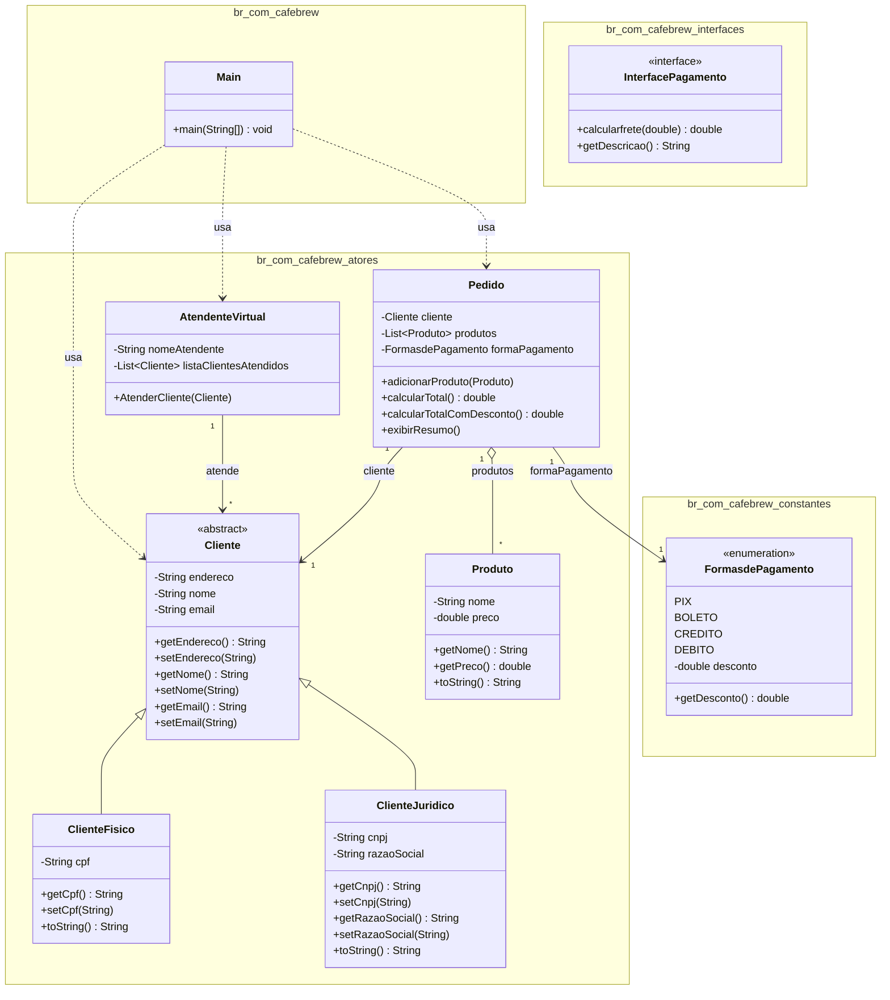

# ☕ CaféBrew

Projeto acadêmico desenvolvido em Java para fixação de conceitos de **Programação Orientada a Objetos (POO)**, simulando o sistema de pedidos de uma cafeteria fictícia chamada *CaféBrew*.

## 📋 Sobre o projeto

O sistema permite cadastrar clientes (pessoa física ou jurídica), montar pedidos com produtos do cardápio, aplicar formas de pagamento com desconto e exibir o resumo final da compra. O projeto explora os quatro pilares da POO — **abstração**, **encapsulamento**, **herança** e **polimorfismo** — além do uso de **enums** para representar constantes de negócio.

## 🗂️ Estrutura de pacotes

```
br.com.cafebrew
├── Main.java                      # Ponto de entrada da aplicação
├── atores/
│   ├── Cliente.java                # Classe abstrata (pai de ClienteFisico e ClienteJuridico)
│   ├── ClienteFisico.java          # Cliente pessoa física (CPF)
│   ├── ClienteJuridico.java        # Cliente pessoa jurídica (CNPJ, razão social)
│   ├── Produto.java                # Item do cardápio (nome, preço)
│   ├── Pedido.java                 # Agrega cliente, produtos e forma de pagamento
│   └── AtendenteVirtual.java       # Atende e registra os clientes
├── interfaces/
│   └── InterfacePagamento.java     # Contrato para cálculo de frete/descrição de pagamento
└── constantes/
    └── FormasdePagamento.java      # Enum com PIX, BOLETO, CREDITO, DEBITO e seus descontos
```

## 🧩 Diagrama de classes



> O diagrama é renderizado automaticamente pelo GitHub. Caso não apareça, visualize com a extensão *Markdown Preview Mermaid Support* ou em [mermaid.live](https://mermaid.live).

## 🛠️ Conceitos de POO aplicados

| Conceito | Onde aparece |
|---|---|
| **Abstração** | `Cliente` é uma classe abstrata que define o contrato comum para clientes |
| **Herança** | `ClienteFisico` e `ClienteJuridico` herdam de `Cliente` |
| **Encapsulamento** | Atributos privados com getters/setters em todas as classes |
| **Polimorfismo** | Sobrescrita do método `toString()` em `ClienteFisico` e `ClienteJuridico` |
| **Enum** | `FormasdePagamento` centraliza as formas de pagamento e seus descontos |
| **Composição/Agregação** | `Pedido` agrega uma lista de `Produto` e referencia um `Cliente` |
| **Interface** | `InterfacePagamento` define um contrato de pagamento (ainda não implementado por nenhuma classe) |

## ▶️ Como executar

Pré-requisito: **JDK 8+** instalado.

```bash
# a partir da raiz do pacote (onde está a pasta br/)
javac br/com/cafebrew/Main.java br/com/cafebrew/atores/*.java br/com/cafebrew/interfaces/*.java br/com/cafebrew/constantes/*.java

java br.com.cafebrew.Main
```

A saída exibirá o resumo de um pedido de exemplo, com o cliente, os produtos, o total e o total com desconto aplicado conforme a forma de pagamento escolhida.

## 🚀 Possíveis melhorias

- Fazer `FormasdePagamento` implementar `InterfacePagamento`, já que a interface foi criada para esse fim mas ainda não é utilizada.
- Adicionar validação de CPF/CNPJ.
- Persistir pedidos e clientes (arquivo ou banco de dados).
- Criar testes unitários para `Pedido` (cálculo de total e desconto).

## 👤 Autor

Projeto desenvolvido como exercício de fixação de Programação Orientada a Objetos.